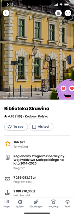

# HackYeah 2023 - EU Funds Go Task

## About project
The project focuses on encouraging users to visit places financed or co-financed by the EU. We primarily want to spark interest and awareness among younger users by offering the ability to create their own avatar, competing in quizzes, and collecting virtual coins.

User activation will involve a daily dose of trivia about EU projects located near the user, and a regular set of challenges, e.g., visit 3 places in Krakow related to the EU, for which users will receive points that can be exchanged for rewards, such as mascots, gift vouchers.

Users will be able to compare their results with others, which will increase the desire to participate in challenges.

The prizes will be sponsored by companies, which, in exchange for their sponsorship, will be showcased in advertisements, and the locations of their branches will be displayed on the map.

## Our goals

- Raising awareness among young people about the EU's involvement in society.
- Encouraging visits to places related to the EU.
- Engaging users through competitive challenges and quizzes.
- The possibility to share one's own opinions and reviews.

## Team members
### UX/UI Design
- [Gabiklos](https://github.com/Gabiklos)
### Backend:
- [Theveloper](https://github.com/theveloper-pl)
- [paulina-biocoder](https://github.com/paulina-biocoder)
### Frontend:
- [DmitriyMenshayev](https://github.com/DmitriyMenshayev)
- [zetdotcom](https://github.com/zetdotcom)

## Technology
### UX/UI Design
- Figma
### Backend:
- Python - Django Rest Framework
### Frontend:
- React